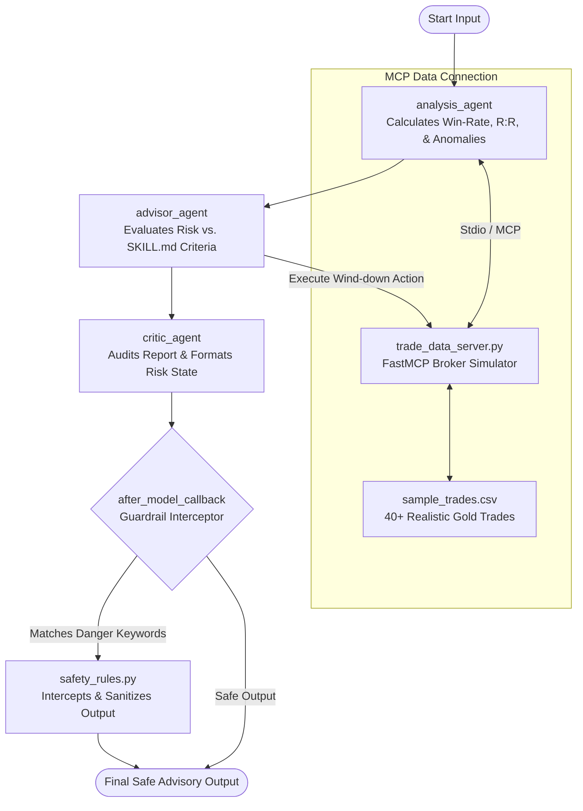

# Trading Risk Coach 🚀
**Kaggle × Google AI Agents Capstone Project — Agents for Business Track**

An AI-first, behavior-driven **Trading Review & Active Risk Copilot** built with the Google Agent Development Kit (ADK) and Model Context Protocol (MCP). It helps personal traders identify harmful psychological anomalies (like the Disposition Effect), quantifies portfolio risk metrics (VaR/CVaR), and enforces strict, deterministic safety limits on trade suggestions.

---

## 1. Project Architecture & Workflow (系统架构)

This project implements a **three-agent risk-control desk** utilizing a multi-agent orchestration pipeline:



---

## 2. Advanced Architectural Concepts (学术级架构特征)

Following best practices from top-tier open-source systems, we implement three core structural features:

### 🏛️ A. Three-Agent Quality Assurance Loop (Critic Node)
Inspired by the *Predict Pro* architecture, the pipeline includes `critic_agent`. Chained after `advisor_agent`, the Critic audits the generated text to guarantee it references exact quantitative metrics (ratios, win rate) and formats the output into a standardized risk layout.

### 🚦 B. Three-Value Risk Logic (三态风控执行)
To minimize unnecessary trading fees (slippage and broker commission), we implement a three-state evaluation paradigm from *Preventing Flash Crashes*:
*   🟢 **Green (Safe)**: All positions have stop losses; risk is <= 1.0%. Keep watching.
*   🟡 **Yellow (Watch)**: Position missing stop loss, but market volatility is low. Action: Automatically attach a stop loss. **Do not close** the trade.
*   🔴 **Red (Breaker)**: Drawdown is critical (>5%) or market volatility spikes. Action: Execute immediate emergency market closure.

### ⚡ C. Fast Lane vs. Governance Lane (双轨治理)
*   **Fast Lane (确定性快速通道)**: Implemented in [safety_rules.py](trading_risk_coach/guardrails/safety_rules.py) via Python regex checks. Runs in < 1ms to act as a **Circuit Breaker (熔断器)** blocking gambling fallacies.
*   **Governance Lane (异步治理通道)**: Implemented in the ADK agent chain, using Gemini for long-term behavior profiling.

---

## 3. Setup & Running Instructions (本地复现与运行)

### Prerequisites:
- Python 3.11+
- A Gemini API Key from Google AI Studio.

### Installation:
1.  **Create and activate a virtual environment:**
    ```bash
    python3 -m venv venv
    source venv/bin/activate  # Windows: venv\Scripts\activate
    ```
2.  **Install dependencies:**
    ```bash
    pip install -r requirements.txt
    ```
3.  **Set up your environment variables:**
    ```bash
    cp .env.example .env
    # Edit .env and enter your GEMINI_API_KEY
    ```

### Running the App:
*   **Run Automated Behavior Tests (SDD verification):**
    ```bash
    python test_sdd_specs.py
    ```
*   **Run Local Validation Runner:**
    ```bash
    python test_runner.py
    ```
*   **Launch Agent in TUI Console:**
    ```bash
    adk run trading_risk_coach
    ```
*   **Launch Agent Web UI Client:**
    ```bash
    adk web trading_risk_coach
    ```
