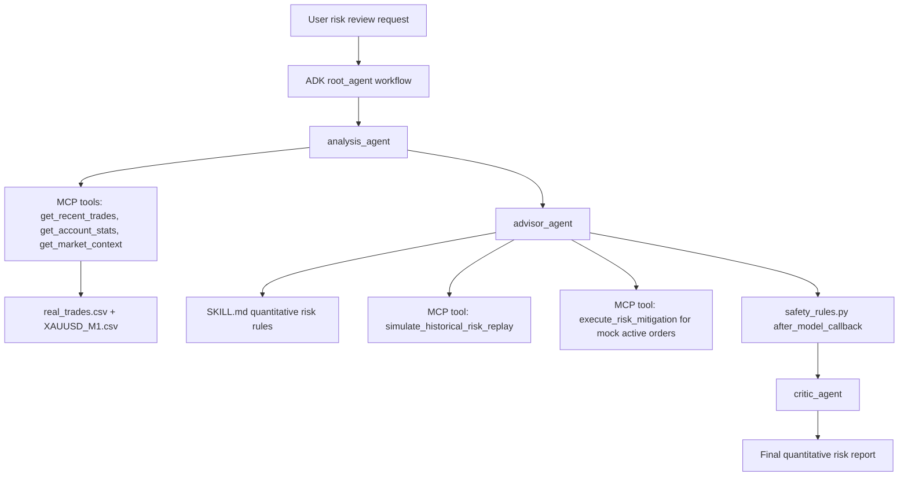

# Trading Risk Coach

**Kaggle x Google AI Agents Capstone Project - Agents for Business Track**

Trading Risk Coach is an AI-first, behavior-driven **Trading Review and Active Risk Copilot** built with the Google Agent Development Kit (ADK) and Model Context Protocol (MCP). It helps personal traders review historical trade behavior, identify harmful psychological risk patterns such as the Disposition Effect, and apply deterministic safety rules before any advice reaches the user.

The project is framed as a risk-control and trade-review system, not as an investment recommendation engine.

## Problem

Personal traders often lose money not only because of market direction, but because of repeated behavior patterns:

- Taking profits too early while allowing losses to grow.
- Trading without hard stop losses.
- Concentrating too much exposure in one symbol or platform.
- Following dangerous recovery logic such as averaging down, holding losing trades, or Martingale sizing.

Trading Risk Coach converts these behaviors into measurable risk signals, routes them through a multi-agent workflow, replays historical price paths to simulate risk-control decisions, and blocks unsafe advice through deterministic guardrails.

## Data Sources

The project uses anonymized real XAUUSD data for the core demo and tests:

| Data | File | Scope |
| --- | --- | --- |
| Trade history | `trading_risk_coach/data/real_trades.csv` | 3,225 paired open/close XAUUSD trades from anonymized MT5 exports. |
| Market context | `trading_risk_coach/data/XAUUSD_M1.csv` | 173,391 rows of XAUUSD one-minute OHLCV candles. |

See [DATA_PRIVACY.md](DATA_PRIVACY.md) for the privacy boundary. No API keys, `.env` file, account credentials, SSH keys, or machine-specific paths are included in the repository.

## Architecture

The system implements an Observe -> Think -> Act -> Audit loop:



More detail: [ARCHITECTURE.md](ARCHITECTURE.md)

## Agent Workflow

| Stage | File | Responsibility |
| --- | --- | --- |
| Root orchestration | `trading_risk_coach/agent.py` | Defines the ADK workflow edges from analysis to advisor to critic. |
| Analysis Agent | `trading_risk_coach/agents/analysis_agent.py` | Reads trade data through MCP tools and computes quantitative risk metrics. |
| Advisor Agent | `trading_risk_coach/agents/advisor_agent.py` | Loads `SKILL.md`, evaluates rule thresholds, and calls active mitigation tools when needed. |
| Critic Agent | `trading_risk_coach/agents/critic_agent.py` | Audits the final response for quantitative evidence, professional formatting, and risk-state clarity. |
| Safety Guardrail | `trading_risk_coach/guardrails/safety_rules.py` | Uses deterministic regex checks to block unsafe trading language. |
| MCP Server | `trading_risk_coach/mcp_server/trade_data_server.py` | Provides stdio MCP tools for real trade reads, market context, account stats, historical risk replay, and simulated broker risk actions. |

## Kaggle Rubric Mapping

| Rubric requirement | Implementation evidence | Verification evidence |
| --- | --- | --- |
| ADK Agent and Multi-Agent workflow | `trading_risk_coach/agent.py` defines `root_agent` with `analysis_agent -> advisor_agent -> critic_agent`. | `python test_runner.py` imports the workflow and prints the registered edges. |
| MCP Server over stdio | `trading_risk_coach/mcp_server/trade_data_server.py` exposes FastMCP tools; `analysis_agent.py` connects with `MCPToolset` and `StdioConnectionParams`. | `python test_sdd_specs.py` validates real-data MCP JSON reads, account stats, historical replay, and active mitigation execution. |
| Agent Skills | `trading_risk_coach/skills/risk_pattern_detection/SKILL.md` defines the Disposition Effect threshold, position risk limit, and three-state risk logic. | `python test_sdd_specs.py` parses `SKILL.md` and asserts the threshold is used by behavior tests. |
| Security Features | `trading_risk_coach/guardrails/safety_rules.py` blocks dangerous advice such as averaging down, holding losses, all-in, and Martingale logic. | `python test_sdd_specs.py` asserts dangerous text is replaced and the original unsafe advice is not leaked. |
| Deployability | `Dockerfile` and `requirements.txt` provide a container-ready runtime. | `docker build -t trading-risk-coach .` can run the same behavior test suite through the default container command. |

## Demo Scenario

Full demo walkthrough: [DEMO.md](DEMO.md)

Click-to-run replay demo: [replay_demo.html](replay_demo.html)

Interactive visual dashboard: [dashboard.html](dashboard.html)

Interactive capstone presentation slides: [presentation.html](presentation.html)

Example user request:

```text
Please analyze my recent XAUUSD trading behavior and tell me whether I am taking unsafe recovery risk.
```

Expected flow:

1. `analysis_agent` calls MCP tools to load recent trades.
2. It computes core metrics such as win rate, average win, average loss, and loss/win ratio.
3. `advisor_agent` compares the metrics against `SKILL.md`.
4. It can call `simulate_historical_risk_replay` to replay prior trades with real M1 candles and simulate what active risk controls would have done.
5. `safety_rules.py` blocks any unsafe recovery advice.
6. `critic_agent` produces a final structured risk report.

## Test Evidence

Run the behavior-driven verification suite:

```bash
python test_sdd_specs.py
```

Current verified coverage:

- Disposition Effect threshold from `SKILL.md`.
- Guardrail interception of averaging-down and holding-loss language.
- Sanitized output does not leak the original dangerous suggestion.
- MCP read tools return valid JSON records, account stats, and symbol summaries from real anonymized XAUUSD exports.
- Historical replay simulates hard-stop and emergency-breaker actions without claiming live broker execution.
- MCP write tool supports `set_hard_sl` and rejects invalid action types.

Run the local ADK smoke test:

```bash
python test_runner.py
```

This verifies that the ADK workflow imports successfully and that the guardrail sanitizer works independently from a live model call.

## Model and Dependency Stability

The agents use:

```python
model="gemini-3.1-flash-lite"
```

Google AI model documentation lists [`gemini-3.1-flash-lite`](https://ai.google.dev/gemini-api/docs/models/gemini-3.1-flash-lite) as a stable Gemini API model string. Dependencies are pinned in `requirements.txt` to the versions used during local verification:

```text
google-adk==2.3.0
mcp==1.28.1
pandas==3.0.3
python-dotenv==1.2.2
```

## Setup

Prerequisites:

- Python 3.11+
- Gemini API key from Google AI Studio

Install:

```bash
python3 -m venv venv
source venv/bin/activate
pip install -r requirements.txt
cp .env.example .env
```

Add your Gemini key to `.env`. This file is local-only and git-ignored:

```bash
GEMINI_API_KEY=
```

Paste your real key after the equals sign in your local `.env`. At runtime the project loads `.env` automatically. If only `GEMINI_API_KEY` is present, it is normalized to `GOOGLE_API_KEY` inside the local Python process for Google ADK/GenAI compatibility. The real key is never written to tracked files.

Note: live Gemini calls also depend on Google AI API regional availability. If the API returns a location support error, run the live demo from a supported network/environment such as Kaggle/Colab or another Google AI-supported region.

Run tests:

```bash
python test_sdd_specs.py
python test_runner.py
```

Run the ADK app:

```bash
adk run trading_risk_coach
```

Or launch the ADK web client:

```bash
adk web trading_risk_coach
```

## Docker

Build:

```bash
docker build -t trading-risk-coach .
```

Run default health verification:

```bash
docker run --rm trading-risk-coach
```

Override the command for ADK web runtime:

```bash
docker run --rm -p 8080:8080 --env-file .env trading-risk-coach adk web trading_risk_coach --host 0.0.0.0 --port 8080
```

## Repository Layout

```text
trading-risk-coach/
├── ARCHITECTURE.md
├── DATA_PRIVACY.md
├── DEMO.md
├── Dockerfile
├── KAGGLE_WRITEUP.md
├── README.md
├── api_server.py
├── dashboard.html
├── presentation.html
├── project_introduction.html
├── replay_demo.html
├── requirements.txt
├── scratch/
├── specs/
├── test_runner.py
├── test_sdd_specs.py
└── trading_risk_coach/
    ├── agent.py
    ├── agents/
    ├── data/
    ├── guardrails/
    ├── mcp_server/
    └── skills/
```

Note: `scratch/` is reserved for local-only exploratory utilities. Python scripts under that directory are ignored so machine-specific paths and private integration experiments do not enter the repository.

## Safety Scope

Trading Risk Coach is an educational risk-review system. It does not provide financial advice, predict market direction, or recommend entries. Its safety layer is intentionally conservative and blocks recovery-trading language before it reaches the user interface.
